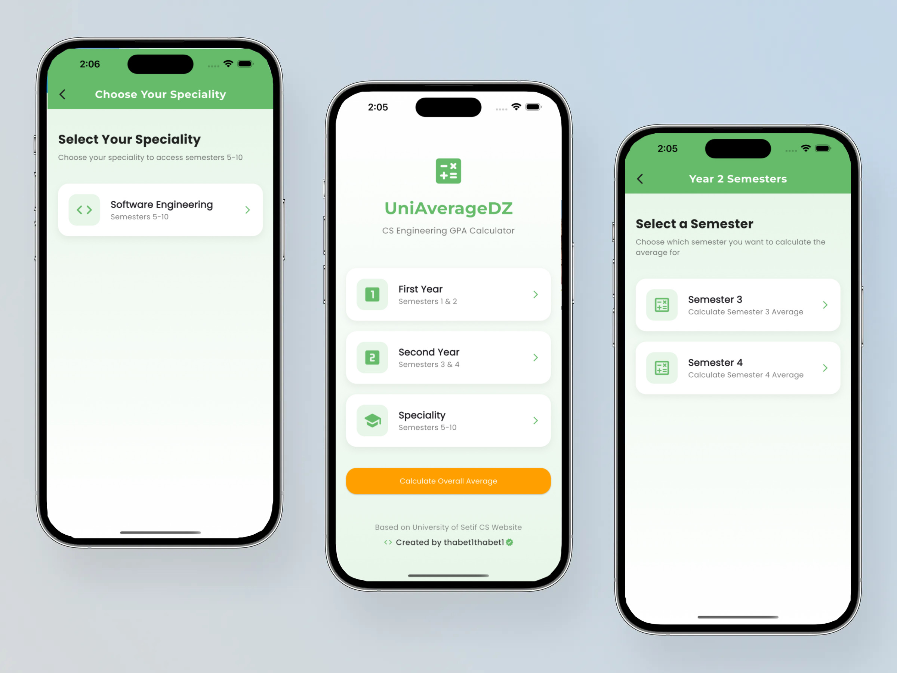
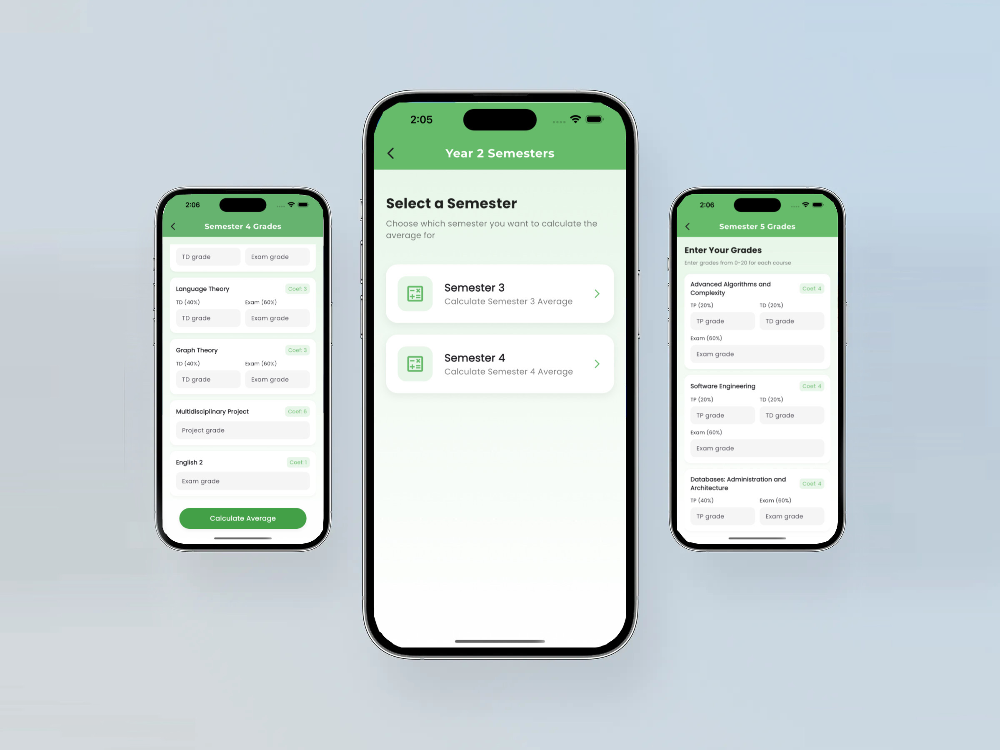

# UniAverageDZ

**UniAverageDZ** is a modern, user-friendly Flutter app designed for Algerian university students to calculate their semester and speciality averages with ease. The app features a beautiful UI, supports multiple decimal formats, and is tailored for the Software Engineering speciality (and more).

## ✨ Features

- 🎓 Select your academic year or speciality (e.g., Software Engineering)
- 📚 Enter grades for each module, with support for TD, TP, Exam, and Project types
- 🧮 Calculates weighted averages based on coefficients and module types
- 🌍 Accepts both `,` and `.` as decimal separators (e.g., `9,5` or `9.5`)
- 📱 Responsive, modern, and mobile-friendly design
- 🎨 Clean, gradient-based UI with floating and pill-shaped buttons
- 🔒 Input validation and user-friendly error messages

## 📸 Screenshots

<p align="center">
  &nbsp;&nbsp;&nbsp;&nbsp;
</p>
## 🚀 How It Works

1. **Choose your year or speciality** (e.g., Software Engineering)
2. **Select a semester** to calculate
3. **Enter your grades** for each module (supports TD, TP, Exam, Project)
4. **Scroll to the bottom** and tap **Calculate Average**
5. Instantly see your weighted semester average and a performance message

## 🛠️ Technologies Used

- [Flutter](https://flutter.dev/) (Dart)
- [Google Fonts](https://pub.dev/packages/google_fonts)
- Material Design

## 🏗️ Getting Started

1. **Clone the repo:**
   ```bash
   git clone https://github.com/yourusername/uniaveragedz.git
   cd uniaveragedz
   ```
2. **Install dependencies:**
   ```bash
   flutter pub get
   ```
3. **Run the app:**
   ```bash
   flutter run
   ```
4. **Build for release:**
   ```bash
   flutter build apk   # Android
   flutter build ios   # iOS
   ```

## 👨‍💻 Development Notes

- The app was built with a focus on clean UI/UX and accurate academic calculations.
- All module and coefficient data is hardcoded for reliability and speed.
- The code is modular and easy to extend for new specialities or years.

## 🙋‍♂️ Author

- **thabet1thabet1**  
  [GitHub](https://github.com/thabet1thabet1)

## 📄 License

This project is licensed under the MIT License.
